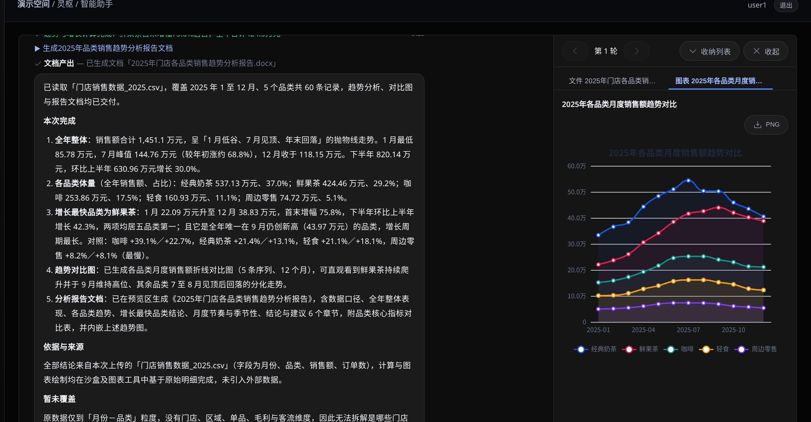
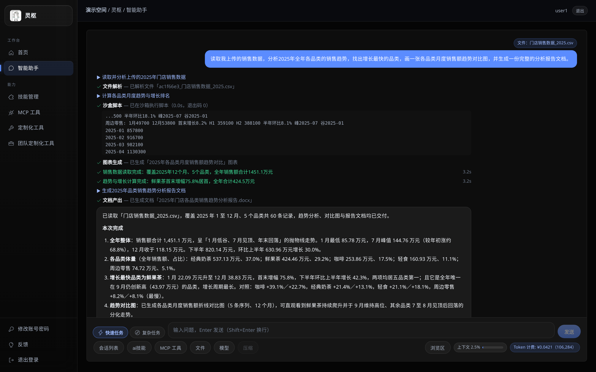
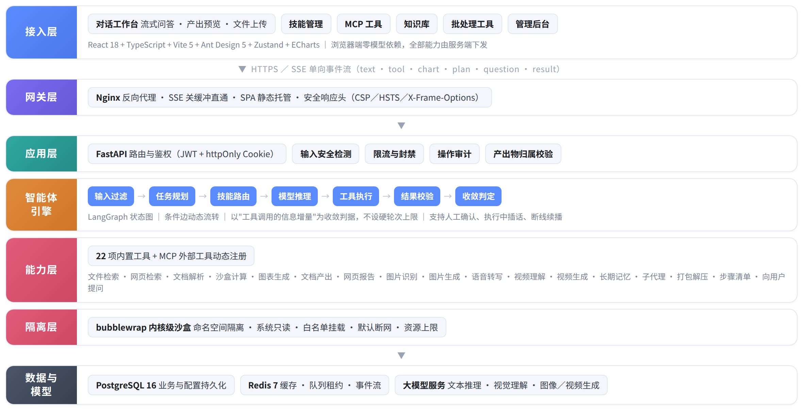
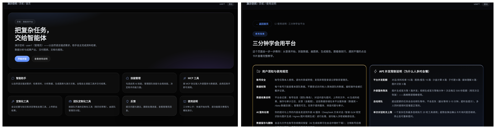

# 灵枢 · 智能体平台

> 基于大语言模型的**多工具自主调度智能体平台**——用户说一句话，智能体自己规划、自己调工具、自己交付结果。

用户以自然语言提出需求，智能体基于状态图引擎自主完成意图理解、任务规划、工具调用与结果校验，
可调度文件检索、文档解析、代码沙盒、图表生成、文档产出、图片识别与生成等 **22 项能力**，
完成资料整理、数据分析、图表绘制、报告与演示文稿生成等任务；平台配套对话式交互界面、知识库、
长期记忆与系统管理后台，并通过权限隔离、内核级沙盒与输入安全检测保障运行安全。

**典型场景**：上传一份门店销售数据，说一句"分析全年各品类销售趋势，找出增长最快的品类，
画趋势对比图并生成分析报告"。智能体依次完成解析、沙盒计算、图表生成与文档产出，
交付一份结论摘要、一张可交互趋势图与一份可直接发送的 Word 报告，全程零人工干预。

<p align="center">
  
</p>

---

## 目录

- [核心能力](#核心能力)
- [技术栈](#技术栈)
- [工程规模](#工程规模)
- [快速开始](#快速开始)
- [配置说明](#配置说明)
- [目录结构](#目录结构)
- [测试](#测试)
- [许可](#许可)

---

## 核心能力

| 模块 | 说明 |
|---|---|
| 对话式交互 | SSE 流式推送（思考过程 + 工具执行过程）、多轮追问、产出物预览与下载、大文件分片上传 |
| 智能体编排 | LangGraph 状态图（规划 → 调工具 → 校验 → 收敛）；以"工具调用的信息增量"为主要收敛判据，另设多条阶梯式护栏与硬性上限兜底 |
| 技能与工具 | Skill（文本层）/ Tool（代码层）分层；注册表 + 元数据（参数 Schema、并发队列、中文展示名）；子代理并行执行 |
| 知识检索 | 统一检索工具（内容块 / 文档标题两层）；按段落切块并保留位置信息，命中后可回溯原文 |
| 长期记忆 | 对话结束异步提取候选记忆，"频次 + 跨会话一致性"双阈值激活；用户可查看/修改/清除 |
| 沙盒执行 | bubblewrap 内核级隔离（系统只读、仅会话工作目录可写、默认断网、内存与单文件限额、超时强杀进程组） |
| 多模态产出 | 12 种 ECharts 图表 + PNG 导出；docx / pptx / xlsx / pdf / html 五类文档产出；文生图 / 文生视频 |
| 媒体理解 | 语音转写（本地 FunASR，不依赖外部 API）+ 视频理解（长视频自动切段） |
| MCP 外部工具 | 协议化接入：管理员启用 ∧ 用户启用双闸门 + 全量调用审计；配套真机浏览器驱动（`real-browser/`） |
| 安全与治理 | 提示词注入检测（8 类规则）、路径越狱防护、SSRF 防护、产出物鉴权、限流与封禁、操作审计 |

<p align="center">
  
</p>

## 技术栈

- **前端**：React 18 + TypeScript + Vite 6 + Ant Design 5 + Zustand + ECharts 6
- **后端**：Python 3.12 + FastAPI + LangGraph（智能体编排）+ SQLAlchemy(async) + asyncpg
- **数据与缓存**：PostgreSQL 16 + Redis 7
- **大模型**：DeepSeek（文本推理，支持思考模式）+ 智谱 GLM（视觉理解 / 图像生成）+ Agnes（多模态）
- **执行隔离**：bubblewrap（Linux 内核命名空间）
- **部署**：Nginx + systemd（开发机亦支持脚本一键起停）
- **质量保障**：断言套件（后端）+ Playwright 端到端（前端）+ Locust 并发压测
- **模型接入**：OpenAI 兼容协议，端点与密钥均由配置提供——私有化场景可指向内网推理服务，无需改动业务代码

## 工程规模

| 项目 | 规模 | 项目 | 规模 |
|---|---|---|---|
| 后端代码 | 120 个 Python 文件 / 26,629 行 | 前端代码 | 54 个文件 / 13,341 行 |
| 接口路由 | 158 条 | 注册工具 | 22 个（用户可见 15 + 系统内部 7） |
| 智能体节点 | 8 个（状态图 + 条件边） | 并发队列 | 10 个分组 |
| 数据表 | 全局库 24 张 + 按团队动态建库 | 模型配置档位 | 6 栏 |
| 图表类型 | 12 种 | 文档输出格式 | 5 种 |

<p align="center">
  
</p>

---

## 快速开始

### 0. 系统依赖

| 依赖 | 版本 | 用途 | 是否必需 |
|---|---|---|---|
| Python | 3.12 | 后端运行时 | 必需 |
| Node.js | 20+ | 前端构建 | 必需 |
| PostgreSQL | 16 | 业务与配置数据 | 必需 |
| Redis | 7 | 缓存、并发租约、事件流 | 必需 |
| **bubblewrap** | 系统包 | **代码沙盒隔离** | 必需 |
| LibreOffice | 任意近期版本 | docx/pptx → PDF、docx → HTML 预览 | 建议 |

```bash
sudo apt update
sudo apt install -y postgresql redis-server bubblewrap libreoffice
```

> ⚠️ **bubblewrap 不在 `requirements.txt` 里**——它是系统包，不是 Python 包。
> 缺少它时 `run_script` 工具会执行失败，但平台其余功能正常。

### 1. 准备数据库

```bash
# 用当前系统用户作为数据库账号（下面示例用 aip，可按需改名）
sudo -u postgres psql -c "CREATE ROLE aip LOGIN PASSWORD 'your_password';"
sudo -u postgres createdb -O aip ai_platform_tardis
```

### 2. 后端

```bash
cd backend

# 创建虚拟环境并安装依赖（也可用 conda，见下）
python3.12 -m venv .venv && source .venv/bin/activate
pip install -r requirements.txt

# 配置：从模板复制后按需修改
cp .env.example .env
#   SECRET_KEY  必须填 >=32 字符的随机值，用模板值服务会拒绝启动
#   GLOBAL_DB_URL / REDIS_URL  按第 1 步的实际账号密码改
#   DEEPSEEK_API_KEY  填上才能实际跑通对话（见下方「关于模型」）

# 建表 + 最小种子（管理员 + 演示账号）
python -m scripts.seed

# 启动
python -m uvicorn app.main:app --host 0.0.0.0 --port 8001
```

### 3. 前端

```bash
cd frontend
npm install
npm run dev          # http://127.0.0.1:5174（/api 代理到 8001）
```

浏览器打开 `http://127.0.0.1:5174`，用种子创建的账号登录：

| 角色 | 账号 | 初始口令 |
|---|---|---|
| 管理员 | `admin` | 环境变量 `SEED_ADMIN_PASSWORD`，未设时为 `change-me-admin` |
| 普通用户 | `user1` | 环境变量 `SEED_USER_PASSWORD`，未设时为 `change-me-user` |

> 首次登录后请立即修改口令。

### 关于模型

平台的实际推理依赖外部模型服务，需要自备 API Key（`backend/.env` 中的 `DEEPSEEK_API_KEY`）。
**没有 Key 时平台可以正常启动、界面可浏览，但对话任务无法执行。**

如需完全离线运行，可把 `DEEPSEEK_BASE_URL` 指向自建的内网推理服务
（任何提供 OpenAI 兼容接口的推理框架均可，如 vLLM / Ollama），业务代码无需改动。

---

## 配置说明

全部配置项见 `backend/.env.example`，常用几项：

| 变量 | 说明 |
|---|---|
| `SECRET_KEY` | **必填**，>=32 字符随机值；用模板值会 fail-fast 拒绝启动 |
| `GLOBAL_DB_URL` / `DEPT_DB_URL_TEMPLATE` / `CEO_DB_URL` | 三个库的连接串 |
| `DB_NAME_PREFIX` | 库名前缀，代码拼 CREATE/DROP/备份库名时统一使用 |
| `REDIS_URL` | Redis 连接串，多实例同机时用库号隔离 |
| `DEEPSEEK_API_KEY` / `ZHIPU_API_KEY` | 模型服务密钥 |
| `AIP_PYTHON` / `NODE_PATH` / `OFFICECLI_BIN_DIR` | 沙盒与技能执行用的解释器与二进制路径，**与默认值不同时必须在此覆盖** |
| `API_PREFIX` | 接口前缀，默认 `/api/v1` |
| `MAX_TOOL_ROUNDS` | 工具轮硬上限；注意代码里还有一层 `max(配置值, 20)` 的下限 |

---

## 目录结构

```
backend/        FastAPI 后端
  app/api/        接口层（158 条路由）
  app/agent/      智能体引擎：状态图、节点、工具、并发队列、模型客户端
  app/core/       基础设施：配置、安全、SSRF 防护、限流、调度器
  app/services/   业务服务（沙盒执行、知识库、记忆、图表、文档转换等）
  app/models/     ORM 模型（24 张表）
  tests/          断言套件
  scripts/        种子、迁移、运维脚本
frontend/       React 前端（src/pages · src/stores · src/api · e2e Playwright 用例）
real-browser/   真机浏览器驱动（以 MCP 协议暴露，让智能体操作真实浏览器）
deploy/         部署脚本与 nginx 站点（start.sh / stop.sh / tardis.nginx）
assets/         README 配图
比赛说明/        项目定位、基本功能与创新点
```

<p align="center">
  
</p>

## 测试

```bash
# 后端断言套件（部分用例需先起后端并配置账号，见脚本头部说明）
cd backend && python -u tests/<用例>.py

# 前端端到端（Playwright）
cd frontend/e2e && bash run-e2e.sh
```

> 回归套件中的付费模型调用一律走模拟通道，真实调用只使用免费档模型，完整回归可零边际成本反复执行。

以下用例无需数据库与网络，可直接运行：

```bash
cd backend
python -u tests/test_ssrf.py            # 外部请求 SSRF 防护校验（25 项）
python -u tests/test_output_guard.py    # 输出侧恶意载荷屏蔽（16 项）
python -u tests/json_safe_smoke.py      # 工具结果异常类型兜底（11 项）
```

---

## 许可

本项目采用 **PolyForm Noncommercial License 1.0.0**（见 [`LICENSE`](LICENSE)）。

- ✅ 个人学习、研究、实验、业余项目——自由使用
- ✅ 学生团体、教育机构、科研机构、公益组织、政府机构——自由使用与二次开发
- ❌ **商业用途需另行授权**（包括但不限于：对外提供付费服务、集成进商业产品、企业内部营利性部署）

版权归 **tardis** 所有。

> 说明：本许可**不是** OSI 认可的开源许可，准确说法是「源码公开、非商业使用」。
